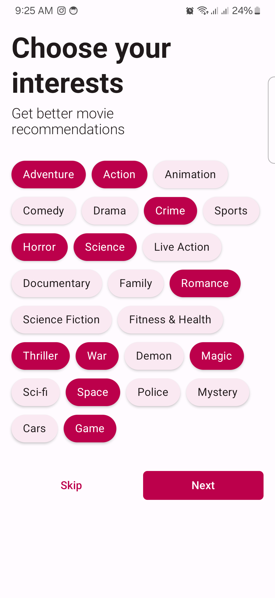

## Interesets Screen

This is just a fun project I created to learn more about [Testing in Android](https://developer.android.com/training/testing). The design is inspired by TikTok.

### 🌠 Screenshot

### 👨🏽‍💻 Covered test

- Coroutines Testing
- Flow testing, including StateFlow
- ViewModel testing
- etc.

### ⚒️ Third Party Libraries Used for Testing

- [JUnit4](https://github.com/junit-team/junit4) - A programmer-oriented testing framework for Java.
- [Mockito](https://github.com/mockito/mockito) - Most popular Mocking framework for unit tests written in Java
- [Mockito Kotlin](https://github.com/mockito/mockito-kotlin) - Mockito-Kotlin is a wrapper library around Mockito.
- [Kotlin Coroutines Test](https://github.com/Kotlin/kotlinx.coroutines/blob/master/kotlinx-coroutines-test/README.md) - Test utilities for kotlinx.coroutines.
- [Turbine](https://github.com/cashapp/turbine) - A small testing library for kotlinx.coroutines Flow
